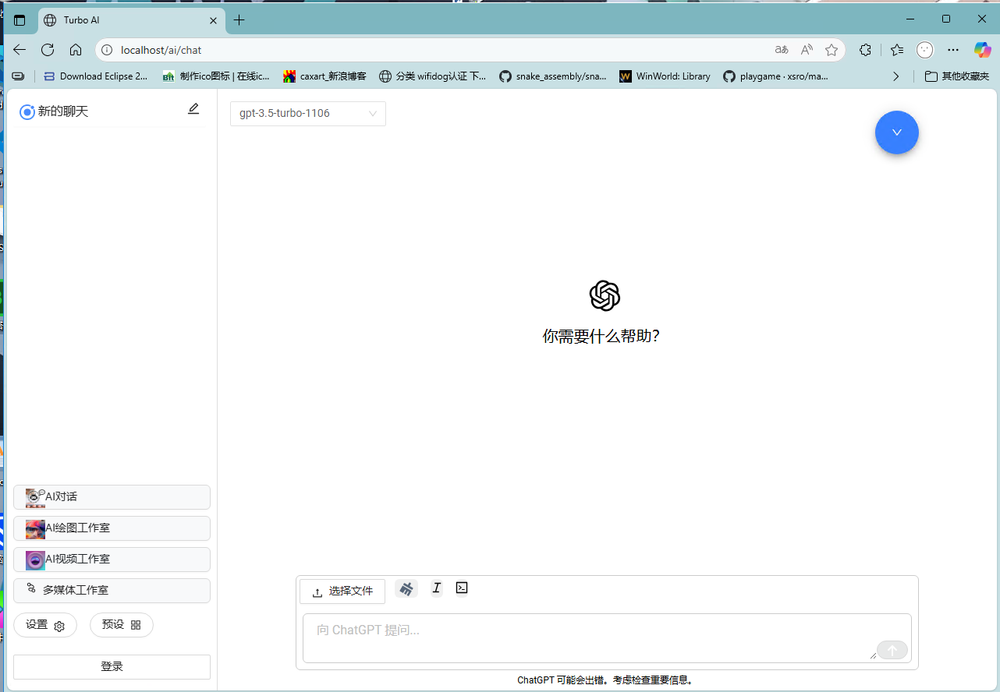

turboai 系统是时候可以公开了。  
相关项目
[turboUI-user](https://github.com/Basicconstruction/turbo-user)  
[turboUI-admin](https://github.com/Basicconstruction/turboai-admin)  
简要来说本系统支持：
- AI 对话 本系统支持OpenAI的GPT系列，Google的Gemini系列以及Claude系列模型。目前支持通用的不包含图片，语音，视频部分的最基本模型。
- AI绘图和AI视频 这部分通过支持[Novita.Ai](novita.ai)公司提供的模型来实现。
- 密钥和模型管理 在管理端可以方便地支持密钥和模型的管理，迅速支持新的密钥。
- 账户管理 系统采用账号进行登录，并通过身份进行权限认证。

另外，相对于普通的开源项目，本系统支持 `对话消息的同步` 以
及`用户端管理模型`。  
系统支持 `PWA`，`配置调整`包括`简易的主题调整`,`多语言支持`(完全的中文和英文支持以及部分日文支持)  

查看架构
[架构](Architecture.md)  
查看功能
[功能](WhatCanIDo.md)
查看技术栈
[技术栈](technoligy.md)
测试
[测试](test.md)
部署
[部署](deploy.md)

部署和调试
本地调试配置文件`appsettings.Development.json`以及部署的配置文件`Production.json`需要自行创建。
位于 /Turbo-Auth 下  
示例文件如下所示，
"Url": "http://0.0.0.0:8000"  代表程序监听本机所有ip地址的8000端口。
主要关注的时数据库配置  
数据库使用 mysql.

```json
{
  "Logging": {
    "LogLevel": {
      "Default": "Error",
      "Microsoft.AspNetCore": "Warning"
    }
  },
  "Jwt": {
    "Issuer": "IAMHERE",
    "Audience": "Ciko",
    "SecretKey": "ffriewoougewinlewknr;jr329ouoeuoieyouneededit"
  },
  "AllowedHosts": "*",
  "Kestrel": {
    "Endpoints": {
      "Http": {
        "Url": "http://0.0.0.0:8000"
      }
    }
  },
  "ConnectionStrings": {
    "ciko": "server=yourserverip;port=3306;database=yourdatabasename;user=yourdbuser;password=yourpassword;Charset=utf8mb4"
  }
}
```
## 使用  
示例图片使用iis部署，并绑定了端口80。 
host:8000/ai 访问对话界面  

host:8000/admin 访问 管理系统  

访问 host:8000/ 你将得不到任何东西，也可以放置一个index.html 到wwwroot下面。

并设置自动跳转， 以便于可以跳转到/ai或者/admin。 
